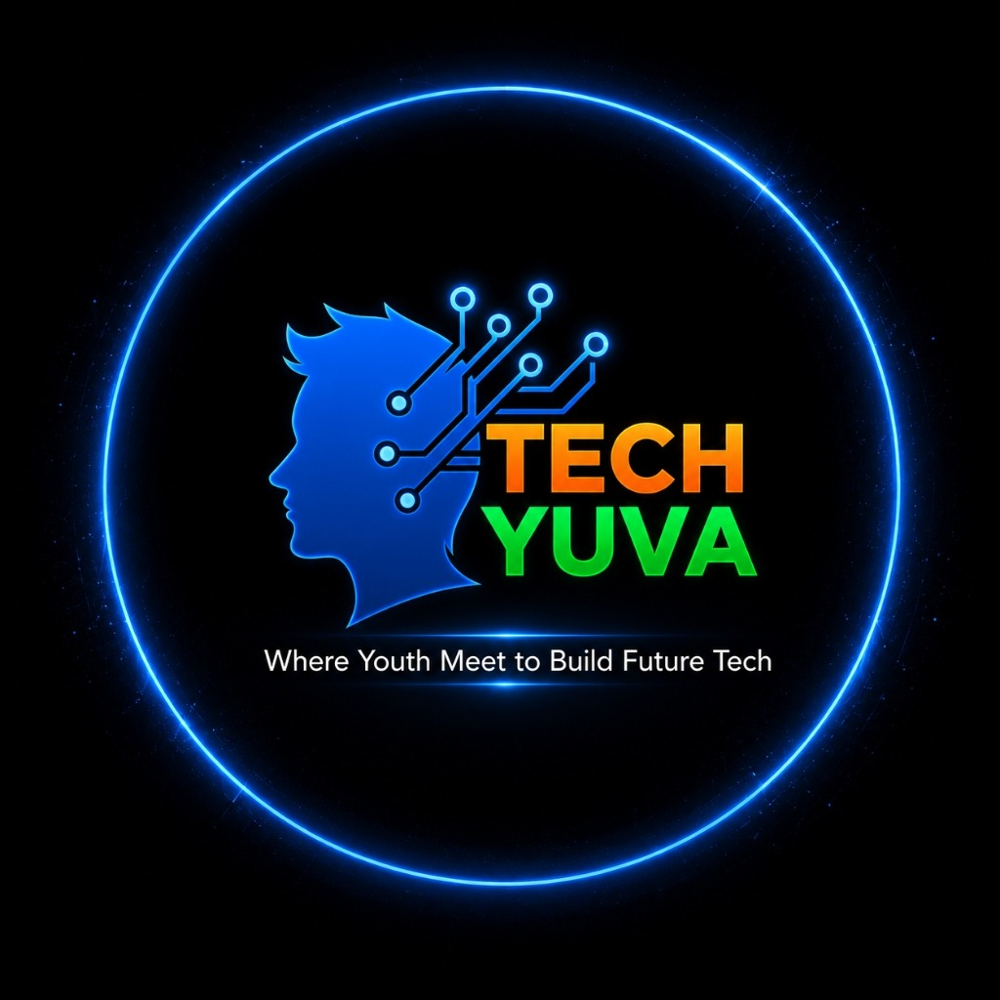

# Tech Yuva — Official Web Ecosystem

<p align="center">
  
</p>

<p align="center">
  <strong>Where Youth Meet to Build Future Tech</strong><br />
  A modern, high-performance web platform built with Next.js 14, React 18, TypeScript, GSAP, and OGL WebGL.
</p>

<p align="center">
  <a href="https://www.techyuva.org/">Website</a> •
  <a href="https://unstop.com/hackathons/drophack-siec-community-1701822">DropHack'26</a> •
  <a href="https://www.linkedin.com/in/techyuva/">LinkedIn</a> •
  <a href="https://www.instagram.com/techyuva_">Instagram</a> •
  <a href="mailto:techyuva.org@gmail.com">Contact</a>
</p>

---

## 🌟 Overview

**Tech Yuva** is a student-led innovation guild based in New Delhi NCR, empowering the next generation of builders through AI, Web3, production systems, and startup culture. 

Rather than theoretical tutorials, Tech Yuva focuses on **deploying alongside** young engineers:
- **Zero fees:** 100% free access for accepted builder cohorts.
- **Production engineering:** Real systems, scalable architectures, cloud credits, and live deployments.
- **Vibrant builder community:** 500+ active members across hackathons, bootcamps, and incubation pipelines.

This repository contains the complete frontend web application, migrated from a vanilla HTML/CSS/JavaScript codebase into a production-ready, performant **React + Next.js (App Router)** platform.

---

## 🚀 Key Features & Experiences

### 1. 🎬 Cinematic Scroll-Driven Canvas Sequence
- Seamless frame-by-frame animation utilizing **270 high-resolution frames** (`/assets/frames/001.png` - `270.png`).
- Scrubbed via **GSAP ScrollTrigger** across a 450vh container with sticky 100vh canvas.
- Responsive object-fit cover rendering with dynamic device-pixel-ratio scaling for mobile performance.
- 5 synchronized narrative phases with staggered typography transitions.
- Full `prefers-reduced-motion` compliance falling back to static poster view.

### 2. 🎠 Auto-Scrolling Photo Marquee & Lightbox Gallery
- High-performance auto-scrolling marquee gallery built with pure CSS `translate3d` transforms.
- Soft gradient edge masking (`mask-image`) to fade cards out seamlessly.
- Pause on hover, focus-within, manual toggle, and offscreen `IntersectionObserver`.
- Accessible desktop control toolbar (Prev, Play/Pause, Next) with keyboard support.
- Fully accessible Lightbox dialog with image zoom, caption titles, photo counter, Escape key dismiss, and focus restoration.
- `prefers-reduced-motion` fallback to horizontal scroll-snap strips.

### 3. 🛡️ Glassmorphism Floating Pill Navbar
- Floating navigation bar with dynamic backdrop blur (`blur(28px) saturate(180%)`).
- Real-time scroll state detection (`.scrolled` compression).
- Active section highlighting (scroll spy) matching `#hero`, `#intro`, `#pillars`, `#showcase`, `#hackathon`, `#founder`, and `#join`.
- Mobile drawer menu with body scroll locking and smooth scrolling anchor links.

### 4. ⚡ Interactive 3D Perspective Tilt & Reveal Animations
- Interactive mouse-tracking 3D tilt across the **5 Pillars** cards (`rotateX` / `rotateY` perspective calculations).
- Global `IntersectionObserver` orchestrating staggered `.reveal-up` and `.reveal-text` entrance animations.
- Milestone counter animations with quartic easing (`500+`, `20+`, `80+`, `1000+`).

### 5. 🏆 Past Events Showcase & Flagship Recaps
- **Workshop on "Cyber Intelligence & Digital Defence" (23 Sep 2026):** Expert session by Vikas Kumar with Code Catalyst Club IMS Ghaziabad on OSINT and digital forensics.
- **DropHack'26 (29 Aug 2026):** High-intensity offline hackathon at Paytm Office, Noida with 150-200 participants across 5 technical tracks and ₹50,000+ prize pool.
- Key highlights, verified stat cards, completed journey timeline, and high-resolution photo marquees.

---

## 🛠️ Technology Stack

| Layer | Technology |
|---|---|
| **Framework** | [Next.js 14](https://nextjs.org/) (App Router, Server & Client Components) |
| **Library** | [React 18](https://react.dev/) + TypeScript |
| **Styling** | Vanilla CSS with Navy Technical Design System Tokens (`app/globals.css`) |
| **Animation Engine** | [GSAP 3](https://greensock.com/gsap/) + [ScrollTrigger](https://greensock.com/scrolltrigger/) |
| **Typography** | Google Fonts ([Outfit](https://fonts.google.com/specimen/Outfit), [Inter](https://fonts.google.com/specimen/Inter), [JetBrains Mono](https://fonts.google.com/specimen/JetBrains+Mono)) |
| **Tooling & Build** | Node.js, npm, Sharp image optimizer, TypeScript compiler (`tsc`) |

---

## 📂 Project Directory Structure

```text
tech_yuva/
├── backend/                # Production Node.js + Express + Supabase API service
│   ├── src/
│   │   ├── config/         # env validation (Zod) & Supabase client (service role)
│   │   ├── controllers/    # community, events, cohorts, stats, contact, admin
│   │   ├── middleware/     # auth, requireRole, validate, rateLimit, errorHandler
│   │   ├── routes/         # versioned URL definitions under /api/v1
│   │   ├── services/       # business logic: email, events, analytics & CSV export
│   │   ├── templates/      # Navy-blue dark HTML email templates (Nodemailer)
│   │   ├── utils/          # ApiError, ApiResponse, logger, csvExport
│   │   ├── validators/     # Zod input validation schemas
│   │   ├── app.js          # Express app (helmet, cors, rate-limit)
│   │   └── server.js       # Starts server on port 5000 with graceful shutdown
│   ├── supabase/
│   │   ├── migrations/     # 001 schema, 002 RLS policies, 003 storage buckets
│   │   └── seed.sql        # Seed data (DropHack'26, New Cohort 2026, metrics)
│   ├── tests/              # Jest & Supertest integration suite (100% passing)
│   ├── .env.example        # Environment variables template
│   ├── package.json        # Backend dependencies & test scripts
│   └── README.md           # Step-by-step Supabase guide & deployment instructions
├── app/
│   ├── globals.css         # Design system tokens, Navy theme tokens & modal styles
│   ├── layout.tsx          # Root layout, Google Fonts, and Next.js SEO metadata
│   └── page.tsx            # Main page assembling all ecosystem sections
├── components/
│   ├── AdmissionBadge.tsx  # Dynamic badge reading admission status from API
│   ├── AuthModal.tsx       # Navy dark themed modal for Login, Sign Up, & Forgot Password
│   ├── CircularGallery.tsx # 3D WebGL cylindrical carousel component (OGL)
│   ├── Cta.tsx             # Community action card with Join Community application modal
│   ├── EventGalleryMarquee.tsx # Auto-scrolling photo marquee & modal lightbox
│   ├── Events.tsx          # Past events recap, DropHack'26 & Cyber Intelligence highlights
│   ├── Footer.tsx          # 4-column navigation grid & guild footer
│   ├── Founder.tsx         # Leadership card for founder Lakshay Soni
│   ├── HeroSequence.tsx    # 270-frame canvas scroll sequence with GSAP
│   ├── Impact.tsx          # Viewport-animated live statistics from backend API
│   ├── Intro.tsx           # Editorial typography & guild overview
│   ├── JoinCommunityModal.tsx # Application form with Zod validation & welcome email
│   ├── Navbar.tsx          # Floating glass pill navbar with auth and admission badge
│   ├── Pathway.tsx         # 5-step builder journey timeline
│   ├── Pillars.tsx         # 5 ecosystem cards with 3D mouse tilt
│   └── ScrollReveal.tsx    # Viewport IntersectionObserver & smooth scroll
├── lib/
│   ├── apiClient.ts        # Frontend HTTP client for Express /api/v1 backend
│   ├── supabaseClient.ts   # Browser Supabase client (public anon key)
│   └── themeConstants.ts   # Navy-blue dark theme tokens & color variables
├── public/
│   └── assets/             # Images, posters, and 270 sequence PNG frames
├── package.json            # Frontend Next.js dependencies
└── README.md               # Main project documentation
```

---

## 🚦 Getting Started

### Prerequisites
- **Node.js:** `v18.17.0` or later (tested on Node `v24.x`)
- **npm:** `v9.x` or later (tested on npm `v11.x`)

### Installation

1. Clone the repository:
   ```bash
   git clone https://github.com/HarryInData/Tech_Yuva.git
   cd Tech_Yuva
   ```

2. Install dependencies:
   ```bash
   npm install
   ```

### Running Locally

To start the local development server:
```bash
npm run dev
```

Open [http://localhost:3000](http://localhost:3000) in your browser to view the application.

### Building for Production

To create an optimized production build:
```bash
npm run build
```

To run the production server locally:
```bash
npm start
```

### 🚢 Production Deployment

The project is structured for immediate zero-config deployment across modern cloud platforms:

#### 1. Vercel (Recommended)
1. Import repository `HarryInData/Tech_Yuva` into [Vercel](https://vercel.com).
2. Framework preset will automatically detect **Next.js**.
3. Environment variables (optional for preview): copy from `.env.example`.
4. Click **Deploy**. Configuration is handled by `vercel.json`.

#### 2. Netlify / Cloudflare Pages / Render
- **Build command:** `npm run build`
- **Publish directory:** `.next` (or standalone server for Node)

#### 3. Static Hosting Fallback
For static preview environments (e.g. GitHub Pages):
- Root `index.html` is fully synchronized with optimized WebP media assets in `/public` and `/events`.

---

## 🎨 Design System & Tokens

The platform uses a dark navy technical aesthetic:

```css
:root {
    --bg-base: #050b18;
    --bg-surface: #0a1329;
    --bg-elevated: #0f1b33;
    --accent: #1e90ff;
    --accent-bright: #38bdf8;
    --accent-soft: rgba(30, 144, 255, 0.12);
    --accent-glow: rgba(30, 144, 255, 0.35);
    --border-default: rgba(30, 144, 255, 0.18);
    --font: 'Outfit', 'Inter', -apple-system, BlinkMacSystemFont, sans-serif;
    --mono: 'JetBrains Mono', 'Fira Code', monospace;
}
```

### Accessibility Standards
- Contrast compliant with **WCAG 2.2 AA**.
- Respects system accessibility setting for `prefers-reduced-motion`.
- Full keyboard navigation and visible focus rings.

---

## 🤝 Community & Connect

- **Official Website:** [https://www.techyuva.org/](https://www.techyuva.org/)
- **Join Community Form:** [Google Form Application](https://docs.google.com/forms/d/e/1FAIpQLSevqw_RcnwyozypufeDObx1sp3bXFgCJghln1etXAKRVYoKSg/viewform)
- **LinkedIn:** [Tech Yuva](https://www.linkedin.com/in/techyuva/)
- **Instagram:** [@techyuva_](https://www.instagram.com/techyuva_)
- **Email:** [techyuva.org@gmail.com](mailto:techyuva.org@gmail.com)

---

## 📄 License & Credits

- © 2026 **Tech Yuva** — Guild Council. All rights reserved.
- Built with ❤️ by Harry & the Tech Yuva builder community.
